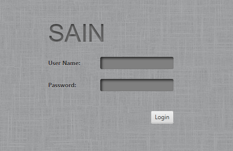
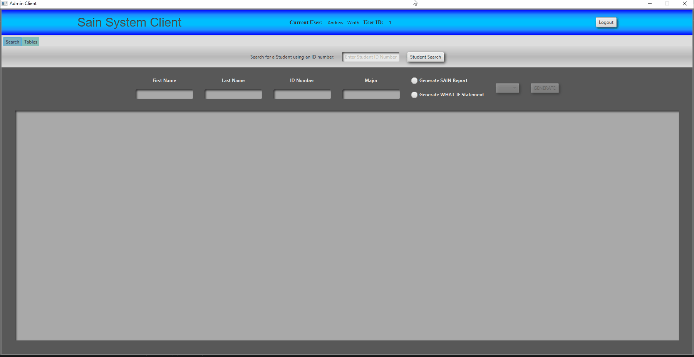
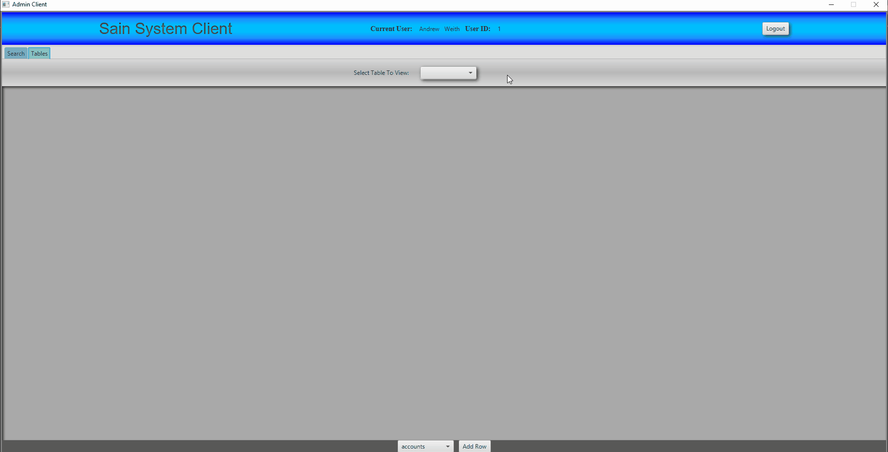
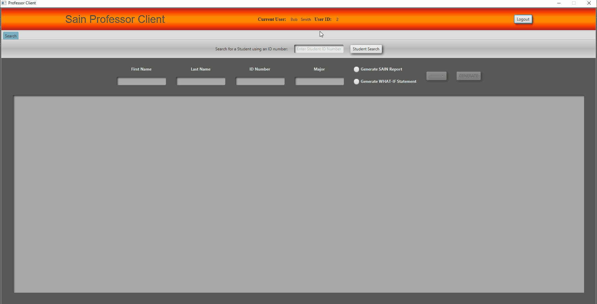
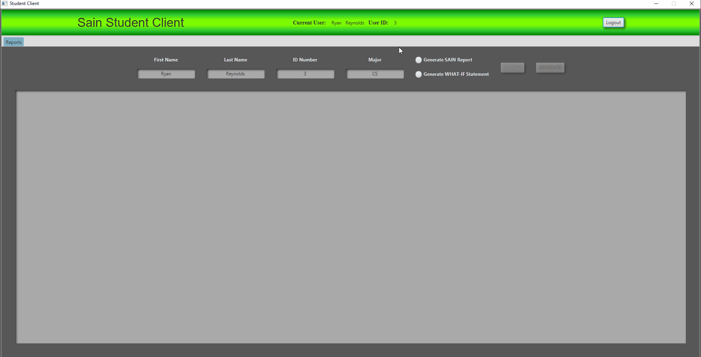

# College Degree Tracker

Final project of a college Java programming course. 

## **Features**

Contains 3 different clients for the user types Student, Teacher, and Administrator.

| User Type | Description |
| --------- | ----------- |
| Student   | Able to view their own degree progress report, and what-if report of their completed courses applied to a different degree program. |
| Teacher   | Can search for any user by ID number, which displays the degree progress report and what-if report of that user. |
| Admin     | Can search for any user by ID number to view their degree progress report and what-if report, and can access database tables through the Tables tab in their Admin client. |

---

## **Demo**
  
* ### Login Page
  
    
    
* ### Administrator Client

    > Search Tab

    
    
    > Tables Tab
    
    
    
* ### Professor Client

    > Search Tab
    
    
    
* ### Student Client

    > Reports Tab
    
    
